# Exercise 10: Documentation of all steps 📝

## Part 1 — Environment Setup and Basics

### 1. Start the environment

Download the repository and start the environment:

```bash
docker compose up -d
```
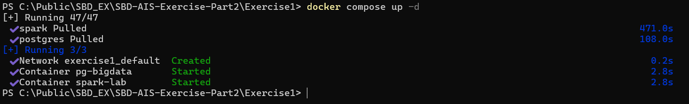

### 2. Access PostgreSQL

```bash
docker exec -it pg-bigdata psql -U postgres
```
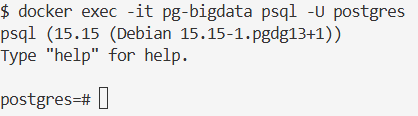

### 3. Load and query data in PostgreSQL

#### 3.1 Create a large dataset

```bash
cd data
python3 expand.py
```
  
  

Creates `data/people_1M.csv` with ~1 million rows.

```bash
wc -l people_1M.csv
```
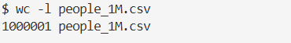  

#### 3.2 Enter PostgreSQL

```bash
docker exec -it pg-bigdata psql -U postgres
```

#### 3.3 Create and load the table

```sql
DROP TABLE IF EXISTS people_big;

CREATE TABLE people_big (
  id SERIAL PRIMARY KEY,
  first_name TEXT,
  last_name TEXT,
  gender TEXT,
  department TEXT,
  salary INTEGER,
  country TEXT
);

\COPY people_big(first_name,last_name,gender,department,salary,country)
FROM '/data/people_1M.csv' DELIMITER ',' CSV HEADER;
```
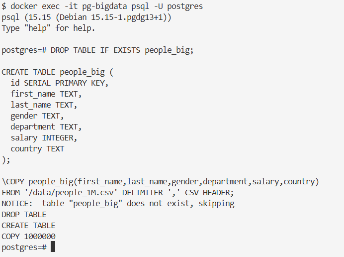  

#### 3.4 Enable timing

```sql
\timing on
```
  

### 4. Verification

```sql
SELECT COUNT(*) FROM people_big;
SELECT * FROM people_big LIMIT 10;
```
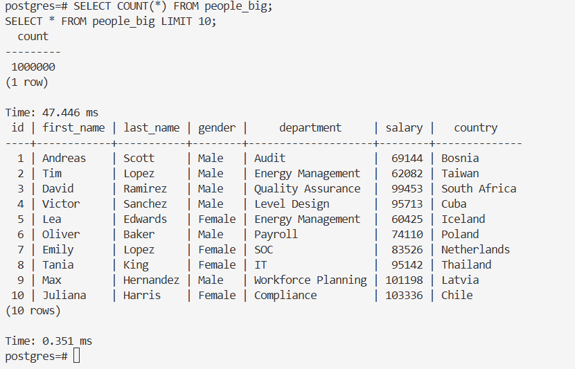  

### 5. Analytical queries

#### (a) Simple aggregation

```sql
SELECT department, AVG(salary)
FROM people_big
GROUP BY department
LIMIT 10;
```
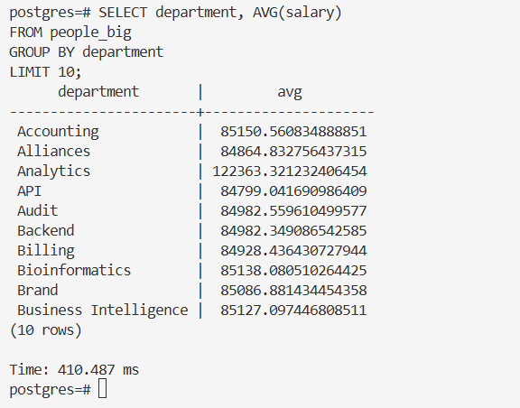

#### (b) Nested aggregation

```sql
SELECT country, AVG(avg_salary)
FROM (
  SELECT country, department, AVG(salary) AS avg_salary
  FROM people_big
  GROUP BY country, department
) sub
GROUP BY country
LIMIT 10;
```
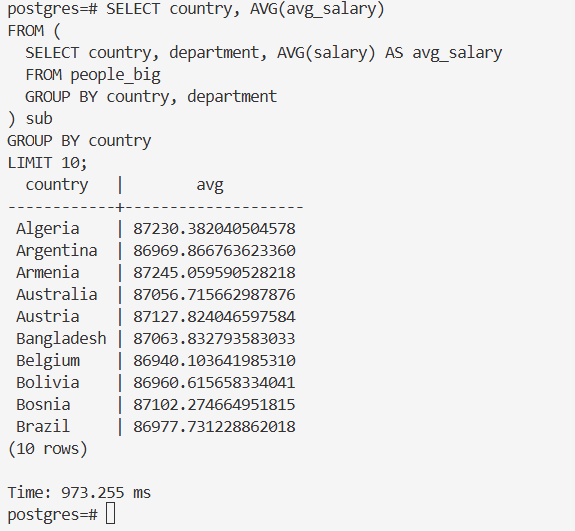  

#### (c) Top-N sort

```sql
SELECT *
FROM people_big
ORDER BY salary DESC
LIMIT 10;
```
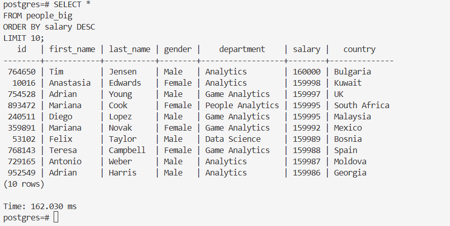  

## Part 2 — Exercises

### Exercise 1 - PostgreSQL Analytical Queries (E-commerce)

In the `ecommerce` folder:

1. **Generate a new dataset by running the provided Python script.**  
       
       
    Then I dropped the generated dataset `orders_1M.csv` into my `data` folder.
2. **Load the generated data into PostgreSQL in a `new table`**.
   - Now I copy paste the following script into Postgres:
   - ```bash
     docker exec -it pg-bigdata psql -U postgres
     ```
     ```bash
        -- 1. Drop table if it exists
        DROP TABLE IF EXISTS orders;

        -- 2. Create table
        CREATE TABLE orders (
            customer_name TEXT,
            product_category TEXT,
            quantity INTEGER,
            price_per_unit NUMERIC(10,2),
            order_date DATE,
            country TEXT
        );

        -- 3. Load CSV into PostgreSQL
        -- Make sure the CSV is accessible inside the container at /data/orders_1M.csv
        \COPY orders(
            customer_name,
            product_category,
            quantity,
            price_per_unit,
            order_date,
            country
        )
        FROM '/data/orders_1M.csv'
        DELIMITER ','
        CSV HEADER;
     ```
    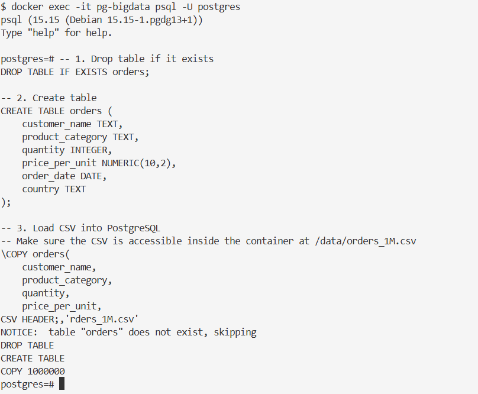

Using SQL ([see the a list of supported SQL commands](https://www.postgresql.org/docs/current/sql-commands.html)), answer the following questions:

**A.** What is the single item with the highest `price_per_unit`?
```sql
SELECT 
    product_category,
    price_per_unit
FROM orders
ORDER BY price_per_unit DESC
LIMIT 1;
```
```sql
 product_category | price_per_unit 
------------------+----------------
 Automotive       |        2000.00
(1 row)
```

**B.** What are the top 3 products with the highest total quantity sold across all orders?
```sql
SELECT 
    product_category,
    SUM(quantity) AS total_quantity_sold
FROM orders
GROUP BY product_category
ORDER BY total_quantity_sold DESC
LIMIT 3;
```

```sql
 product_category | total_quantity_sold 
------------------+---------------------
 Health & Beauty  |              300842
 Electronics      |              300804
 Toys             |              300598
(3 rows)
```


**C.** What is the total revenue per product category?  
(Revenue = `price_per_unit × quantity`)  

```sql
SELECT 
    product_category,
    SUM(price_per_unit * quantity) AS total_revenue
FROM orders
GROUP BY product_category
ORDER BY total_revenue DESC;
```

```sql
 product_category | total_revenue
------------------+---------------
 Automotive       |  306589798.86
 Electronics      |  241525009.45
 Home & Garden    |   78023780.09
 Sports           |   61848990.83
 Health & Beauty  |   46599817.89
 Office Supplies  |   38276061.64
 Fashion          |   31566368.22
 Toys             |   23271039.02
 Grocery          |   15268355.66
 Books            |   12731976.04
(10 rows)
```

**D.** Which customers have the highest total spending?

```sql
SELECT 
    customer_name,
    SUM(price_per_unit * quantity) AS total_spent
FROM orders
GROUP BY customer_name
ORDER BY total_spent DESC
LIMIT 20;
```

```sql
 customer_name  | total_spent 
----------------+-------------
 Carol Taylor   |   991179.18
 Nina Lopez     |   975444.95
 Daniel Jackson |   959344.48
 Carol Lewis    |   947708.57
 Daniel Young   |   946030.14
 Alice Martinez |   935100.02
 Ethan Perez    |   934841.24
 Leo Lee        |   934796.48
 Eve Young      |   933176.86
 Ivy Rodriguez  |   925742.64
 Nina Robinson  |   923627.53
 John Thomas    |   922858.59
 Eve Taylor     |   917620.11
 Henry Smith    |   916273.48
 Mia Wilson     |   914740.05
 Liam Johnson   |   914266.79
 Alice Brown    |   913262.30
 Bob Walker     |   913202.74
 Olivia Sanchez |   912017.65
 Amelia Moore   |   911627.44
(20 rows)
```


### Exercise 2
Assuming there are naive joins executed by users, such as:
```sql
SELECT COUNT(*)
FROM people_big p1
JOIN people_big p2
  ON p1.country = p2.country;
```
### Problem Statement

This query takes more than **10 minutes** to complete, significantly slowing down the entire system. Additionally, the **OLTP database** currently in use has inherent limitations in terms of **scalability and efficiency**, especially when operating in **large-scale cloud environments**.

### Discussion Question

Considering the requirements for **scalability** and **efficiency**, what **approaches and/or optimizations** can be applied to improve the system’s:

- Scalability  
- Performance  
- Overall efficiency  

Please **elaborate with a technical discussion**.

> **Optional:** Demonstrate your proposed solution in practice (e.g., architecture diagrams, SQL examples, or code snippets).

### My Answer to the Discussion Question

**First let's analyze what happens in the query:**
- for each row in `p1`, PostgreSQL finds **all rows in** `p2` **with the same country**
- so if a country has `n` rows it produces `n*n` join results
- in our case this quickly becomes hundreds of millions or billions of rows
- even though the final result is only a `COUNT(*)`, the database still needs to:
  - build the join result
  - materialize or stream it
  - and aggregate it
- Thus the **time complexity explodes**.

#### Ideas for improvement
1. **Rewrite the query:**
    - we can rewrite the query to avoid the join, avoiding to count all, e.g.:   
    ```sql
    SELECT SUM(cnt * cnt)
    FROM (
        SELECT country, COUNT(*) AS cnt
        FROM people_big
        GROUP BY country
    ) sub;
    ```
    - this groups on a low-cardinality column, is faster, has no join explosion and reduces the complexity
    
2. **Architectural Improvements (Scalability)**
   - Separating OLTP and OLAP Workloads can help overcome the issue
   - right now OLTP is used for transactions and heavy analytics, this causes lock contention, cache pollution and slow response times for users
   - an improved architecture could look like this:
   ```powershell
   OLTP PostgreSQL -> ETL/CDC -> OLAP Data Warehouse
   ```
      - Benefits: Analytical queries no longer block the transactions, scalability improves through independent scaling, and cloud resources are used more efficiently.
        - **OLTP** handles fast inserts, updates, and user-facing queries
        - **ETL/CDC** transfers data periodically or in near real time
        - **OLAP** is optimized for heavy analytics, aggregations, and reporting

3. **Implementing query timeouts to prevent runaway queries**  
   - users should avoid naive joins and rely more on pre-aggregated or indexed queries
   - monitoring slow queries to optimize expensive operations 


### Exercise 3
### Run with Spark (inside Jupyter)

Open your **Jupyter Notebook** environment:

- **URL:** http://localhost:8888/?token=lab  
- **Action:** Create a new notebook

Then run the following **updated Spark example**, which uses the same data stored in **PostgreSQL**.

---

### Spark Example Code

```python
# ============================================
# 0. Imports & Spark session
# ============================================

import time
import builtins  # <-- IMPORTANT
from pyspark.sql import SparkSession
from pyspark.sql.functions import (
    avg,
    round as spark_round,   # Spark round ONLY for Columns
    count,
    col,
    sum as _sum
)

spark = (
    SparkSession.builder
    .appName("PostgresVsSparkBenchmark")
    .config("spark.jars.packages", "org.postgresql:postgresql:42.7.2")
    .config("spark.eventLog.enabled", "true")
    .config("spark.eventLog.dir", "/tmp/spark-events")
    .config("spark.history.fs.logDirectory", "/tmp/spark-events")
    .config("spark.sql.shuffle.partitions", "4")
    .config("spark.default.parallelism", "4")
    .getOrCreate()
)

spark.sparkContext.setLogLevel("WARN")

# ============================================
# 1. JDBC connection config
# ============================================

jdbc_url = "jdbc:postgresql://postgres:5432/postgres"
jdbc_props = {
    "user": "postgres",
    "password": "postgres",
    "driver": "org.postgresql.Driver"
}

# ============================================
# 2. Load data from PostgreSQL
# ============================================

print("\n=== Loading people_big from PostgreSQL ===")

start = time.time()

df_big = spark.read.jdbc(
    url=jdbc_url,
    table="people_big",
    properties=jdbc_props
)

# Force materialization
row_count = df_big.count()

print(f"Rows loaded: {row_count}")
print("Load time:", builtins.round(time.time() - start, 2), "seconds")

# Register temp view
df_big.createOrReplaceTempView("people_big")

# ============================================
# 3. Query (a): Simple aggregation
# ============================================

print("\n=== Query (a): AVG salary per department ===")

start = time.time()

q_a = (
    df_big
    .groupBy("department")
    .agg(spark_round(avg("salary"), 2).alias("avg_salary"))
    .orderBy("department", ascending=False)
    .limit(10)
)

q_a.collect()
q_a.show(truncate=False)
print("Query (a) time:", builtins.round(time.time() - start, 2), "seconds")

# ============================================
# 4. Query (b): Nested aggregation
# ============================================

print("\n=== Query (b): Nested aggregation ===")

start = time.time()

q_b = spark.sql("""
SELECT country, AVG(avg_salary) AS avg_salary
FROM (
    SELECT country, department, AVG(salary) AS avg_salary
    FROM people_big
    GROUP BY country, department
) sub
GROUP BY country
ORDER BY avg_salary DESC
LIMIT 10
""")

q_b.collect()
q_b.show(truncate=False)
print("Query (b) time:", builtins.round(time.time() - start, 2), "seconds")

# ============================================
# 5. Query (c): Sorting + Top-N
# ============================================

print("\n=== Query (c): Top 10 salaries ===")

start = time.time()

q_c = (
    df_big
    .orderBy(col("salary").desc())
    .limit(10)
)

q_c.collect()
q_c.show(truncate=False)
print("Query (c) time:", builtins.round(time.time() - start, 2), "seconds")

# ============================================
# 6. Query (d): Heavy self-join (COUNT only)
# ============================================

print("\n=== Query (d): Heavy self-join COUNT (DANGEROUS) ===")

start = time.time()

q_d = (
    df_big.alias("p1")
    .join(df_big.alias("p2"), on="country")
    .count()
)

print("Join count:", q_d)
print("Query (d) time:", builtins.round(time.time() - start, 2), "seconds")

# ============================================
# 7. Query (d-safe): Join-equivalent rewrite
# ============================================

print("\n=== Query (d-safe): Join-equivalent rewrite ===")

start = time.time()

grouped = df_big.groupBy("country").agg(count("*").alias("cnt"))

q_d_safe = grouped.select(
    _sum(col("cnt") * col("cnt")).alias("total_pairs")
)

q_d_safe.collect()
q_d_safe.show()
print("Query (d-safe) time:", builtins.round(time.time() - start, 2), "seconds")

# ============================================
# 8. Cleanup
# ============================================

spark.stop()
```

**Output**
```python

=== Loading people_big from PostgreSQL ===
Rows loaded: 1000000
Load time: 9.36 seconds

=== Query (a): AVG salary per department ===
+------------------+----------+
|department        |avg_salary|
+------------------+----------+
|Workforce Planning|85090.82  |
|Web Development   |84814.36  |
|UX Design         |84821.2   |
|UI Design         |85164.64  |
|Treasury          |84783.27  |
|Training          |85148.1   |
|Tax               |85018.57  |
|Sustainability    |85178.99  |
|Supply Chain      |84952.89  |
|Subscriptions     |84899.19  |
+------------------+----------+

Query (a) time: 11.36 seconds

=== Query (b): Nested aggregation ===
+------------+-----------------+
|country     |avg_salary       |
+------------+-----------------+
|Egypt       |87382.22963311202|
|Kuwait      |87349.3517377211 |
|Saudi Arabia|87348.80512175431|
|Panama      |87345.00623707911|
|Denmark     |87328.03514120901|
|Jamaica     |87305.43735208298|
|Lebanon     |87292.76891750698|
|Turkey      |87290.69043798618|
|Malaysia    |87253.78746341488|
|Kazakhstan  |87251.74274968785|
+------------+-----------------+

Query (b) time: 7.45 seconds

=== Query (c): Top 10 salaries ===
+------+----------+---------+------+----------------+------+------------+
|id    |first_name|last_name|gender|department      |salary|country     |
+------+----------+---------+------+----------------+------+------------+
|764650|Tim       |Jensen   |Male  |Analytics       |160000|Bulgaria    |
|10016 |Anastasia |Edwards  |Female|Analytics       |159998|Kuwait      |
|754528|Adrian    |Young    |Male  |Game Analytics  |159997|UK          |
|240511|Diego     |Lopez    |Male  |Game Analytics  |159995|Malaysia    |
|893472|Mariana   |Cook     |Female|People Analytics|159995|South Africa|
|359891|Mariana   |Novak    |Female|Game Analytics  |159992|Mexico      |
|53102 |Felix     |Taylor   |Male  |Data Science    |159989|Bosnia      |
|768143|Teresa    |Campbell |Female|Game Analytics  |159988|Spain       |
|729165|Antonio   |Weber    |Male  |Analytics       |159987|Moldova     |
|952549|Adrian    |Harris   |Male  |Analytics       |159986|Georgia     |
+------+----------+---------+------+----------------+------+------------+

Query (c) time: 7.56 seconds

=== Query (d): Heavy self-join COUNT (DANGEROUS) ===
Join count: 10983941260
Query (d) time: 37.97 seconds

=== Query (d-safe): Join-equivalent rewrite ===
+-----------+
|total_pairs|
+-----------+
|10983941260|
+-----------+

Query (d-safe) time: 3.25 seconds
```  

### Analysis and Discussion

Now, explain in your own words:

- **What the Spark code does:**  
  Describe the workflow, data loading, and the types of queries executed (aggregations, sorting, self-joins, etc.).
   
   - **Setup and Initialization**
     - the necessary spark modules and functions are imported
     - **SparkSession** is created, configured with PostgreSQL JDBC driver, prallelism settings and event logging
   - **Data Loading**
     - connection via JDBC to the PostgreSQL `people_big` table
     - dataset is loaded into a Spark DataFrame (`df_big`) and materialized with `.count()` -> this ensures that all rows are read
     - a **temporary view** (`people_big`) is then registered for running SQL style queries via Spark SQL
   - **Query (a) - simple aggregation**
      - Computes the **average salary per department** using `groupBy` and `agg`
      - shows basic Spark aggregations and ordering
      - this executes efficiently on 1M rows
   - **Query (b) - nested aggregation**
     - computes **average salary per country**, first aggregating by department and country
     - uses **nested/grouped aggregations** using Spark SQL
   - **Query (c) - Sorting + Top-N**
     - finds the **top 10 salaries** by ordering the DataFrame in descending order
   - **Query (d): Heavy self-join (COUNT only)**
      - performs a **self-join** on the `country` column to count all pairs
      - this results in billions of intermediate rows -> inefficient for large datasets
   - **Query (d-safe): Join-equivalent rewrite**
     - rewrites the self-join as a **group-by and sum-of-squares** aggregation
     - this improves the performance
   - **Cleanup** -> stops the spark session to release thr resources


- **Architectural contrasts with PostgreSQL:**  
  Compare the Spark distributed architecture versus PostgreSQL’s single-node capabilities, including scalability, parallelism, and data processing models.
    - **Spark** uses a distributed, in-memory architecture that processes the data in parallell and across multiple nodes. This enables faster aggregations and large-scale analytics.
    - **PostgreSQL**  is a single node OLTP system that is optimized for transactional workloads. Especially for heavy joins or aggregations on large datasets this can become slow, thus Spark is definitely the better choice since it is more scalable and efficient for analytical queries with over millions of rows. 

- **Advantages and limitations:**  
  Highlight the benefits of using Spark for large-scale data processing (e.g., in-memory computation, distributed processing) and its potential drawbacks (e.g., setup complexity, overhead for small datasets).
    - **Advantages:** As already mentioned Spark can handle large-scale data very efficiently using distributed, in-memory computation -> this speeds up aggregations, joins and complex analytics.
    - **Drawbacks/Limitations:** It can be complex to set up and potentially introduce overhead for datasets that are small. A simple database like PostgreSQL could be faster and easier to use in such cases.

- **Relation to Exercise 2:**  
  Connect this approach to the concepts explored in Exercise 2, such as performance optimization and scalability considerations.
    - In **Exercise 2** the issue was that naive self-joins on a large PostgreSQL table were extremely slow (over 10 minutes) because PostgreSQL is single-node and has to process billions of intermediate rows. Heavy queries also block transactional workloads, showing the limits of OLTP for analytics.
    - In **Exercise 3** I run the same data in Spark, which distributes computation across multiple nodes and uses in-memory processing. By combining optimized queries (avoiding naive joins) with Spark’s architecture, I could get the same results in seconds instead of minutes.
    - **Thus I conclude that:** compared to PostgreSQL, Spark is much more scalable and efficient for large-scale analytical workloads, while PostgreSQL is better suited for transactional tasks.

### Exercise 4
Port the SQL queries from exercise 1 to spark.

I included the code in my `SparkExample.ipynb`.

**Results:**

```python
#Load the orders table from PostgreSQL
df_orders = spark.read.jdbc(
    url=jdbc_url,
    table="orders",
    properties=jdbc_props
)

df_orders.createOrReplaceTempView("orders")

#A. Single item with highest price_per_unit
q_A = df_orders.orderBy(col("price_per_unit").desc()).limit(1)
q_A.show()
```
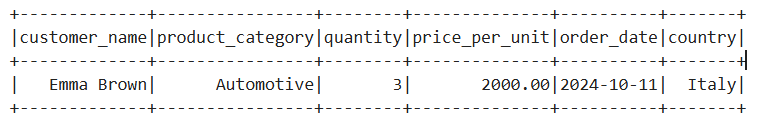  

```python
#B. Top 3 products with highest total quantity sold
q_B = (
    df_orders
    .groupBy("product_category")
    .agg(_sum("quantity").alias("total_quantity_sold"))
    .orderBy(col("total_quantity_sold").desc())
    .limit(3)
)
q_B.show()
```
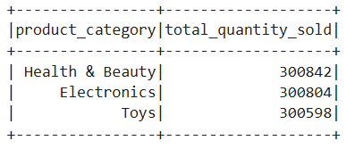  
 
```python
#C. Total revenue per product category
q_C = (
    df_orders
    .groupBy("product_category")
    .agg(_sum(col("price_per_unit") * col("quantity")).alias("total_revenue"))
    .orderBy(col("total_revenue").desc())
)
q_C.show()
```
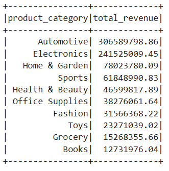  


```python
#D. Customers with highest total spending
q_D = (
    df_orders
    .groupBy("customer_name")
    .agg(_sum(col("price_per_unit") * col("quantity")).alias("total_spent"))
    .orderBy(col("total_spent").desc())
    .limit(20)
)
q_D.show()
```
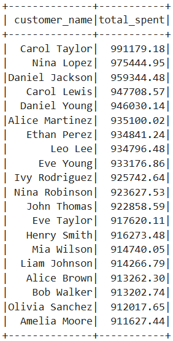  

## Conclusion  
In this exercise, I explored large-scale data processing using both PostgreSQL and Spark. PostgreSQL handled OLTP queries well but struggled with heavy aggregations and joins on a large dataset, while Spark’s distributed, in-memory architecture significantly improved performance and scalability.  
 By comparing naive SQL queries with optimized approaches in both systems, I saw firsthand how architecture and query design impact efficiency, making Spark a better choice for large-scale analytical workloads.