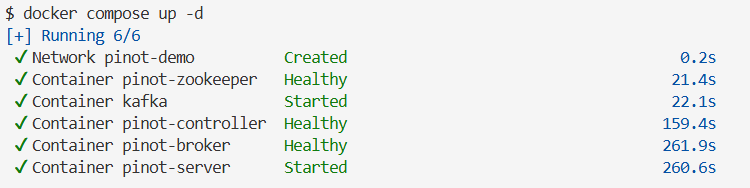
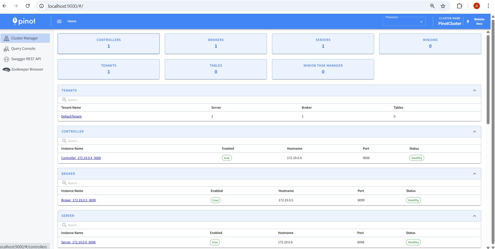
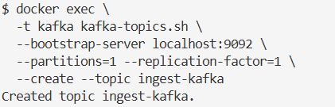
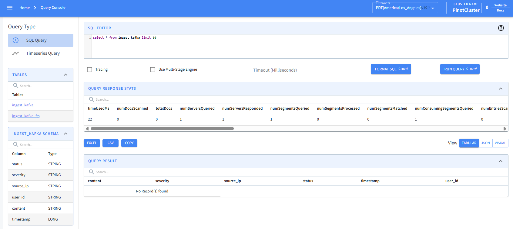
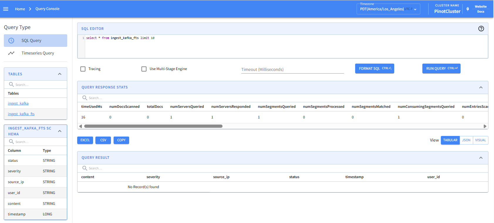
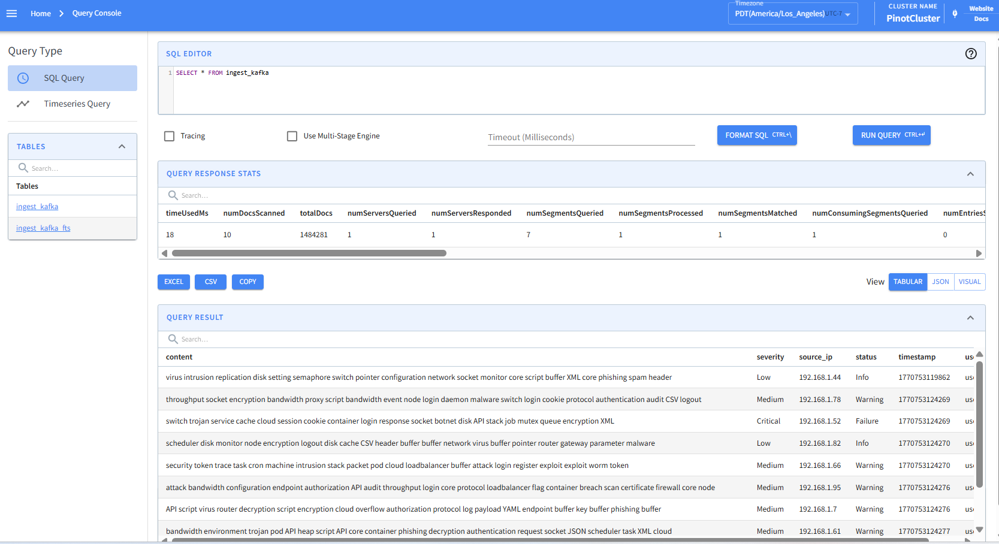
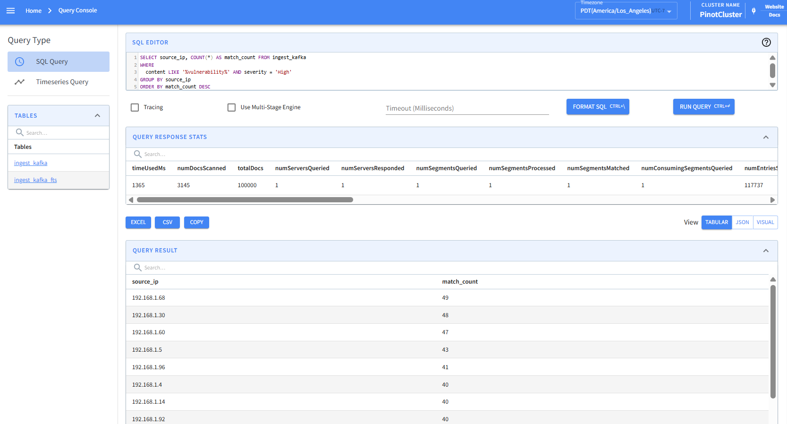

# Exercise 10: NoSQL advanced
**Name:** Annalena Salchegger  
**Time:** ~ 4 hours

## Start the environment

Download the repository and start the environment:

```bash
docker compose up -d
```


## Verify the services
-Apache Pinot's Web UI: http://localhost:9000  



## Create a kafka topic:
```bash
docker exec \
  -t kafka kafka-topics.sh \
  --bootstrap-server localhost:9092 \
  --partitions=1 --replication-factor=1 \
  --create --topic ingest-kafka
```


# Learn more about Apache Pinot
- Apache Pinot's home page: https://docs.pinot.apache.org/ 

# Basic setup

Understand the content of [ingest schema file](ingest_kafka_schema.json) and [table creation file](ingest_kafka_realtime_table.json). Then, navigate to Apache Pinot's Web UI and add a table schema and a realtime table. 

### Adding the tables
#### Baseline Schema
```bash
curl -X POST http://localhost:9000/schemas \
  -H "Content-Type: application/json" \
  -d @ingest_kafka_schema.json
```

#### Baseline Table
```bash
curl -X POST http://localhost:9000/tables \
  -H "Content-Type: application/json" \
  -d @ingest_kafka_realtime_table.json
```

#### FTS Schema
```bash
curl -X POST http://localhost:9000/schemas \
  -H "Content-Type: application/json" \
  -d @ingest_kafka_schema_fts.json
```

#### FTS Table
```bash
curl -X POST http://localhost:9000/tables \
  -H "Content-Type: application/json" \
  -d @ingest_kafka_realtime_table-fts.json
```  

  
  

### Navigate to ```Query Console``` and run your first query:

```sql
select * from ingest_kafka
```

### More advanced query:

```sql
SELECT source_ip, COUNT(*) AS match_count FROM ingest_kafka
WHERE
  content LIKE '%vulnerability%' AND severity = 'High'
GROUP BY source_ip
ORDER BY match_count DESC    
```

See more about queries' syntax: https://docs.pinot.apache.org/users/user-guide-query

What are we missing when we execute the queries?
The data records

See how to ingest data on Apache Pinot: https://docs.pinot.apache.org/manage-data/data-import

# Load generator
Inside the ```load-generator``` folder, understand the content of the docker compose file and start generating log records: 
```bash
docker compose up -d
```
#### Simple Query
   
**This means:**
- Table exists  
- Kafka ingestion works  
- Load generator works  
- Pinot is storing logs  
- Queries run successfully  

**Quick Overview of one log record**
| Field     | Meaning          |
| --------- | ---------------- |
| content   | Log message text |
| severity  | Risk level       |
| source_ip | Origin IP        |
| status    | Log status       |
| timestamp | Event time       |
| user_id   | User             |

### Run again the advanced query:

```sql
SELECT source_ip, COUNT(*) AS match_count FROM ingest_kafka
WHERE
  content LIKE '%vulnerability%' AND severity = 'High'
GROUP BY source_ip
ORDER BY match_count DESC    
```



How this last query relates to the Spark Structured Streaming logs processing example from Exercise 3? 

Practical Exercise: From the material presented in the previous lecture on ``` Analytical Processing``` and Apache Pinot's features (available at https://docs.pinot.apache.org/ ), analyze and explain how the performance of the advanced query could be improved without demanding additional computing resources. Then, implement and demonstrate such an approach in Apache Pinot. What we did together in the exercise session is one of the most profitable solutions. Replicating it is acceptable, but also feel free to explore other alternatives.

Foundational Exercise: Considering the material presented in the lecture ``` NoSQL - Data Processing & Advanced Topics``` and Apache Pinot's concepts https://docs.pinot.apache.org/basics/concepts and architecture https://docs.pinot.apache.org/basics/concepts/architecture, how an OLAP system such as Apache Pinot relates to NoSQL and realizes Sharding, Replication, and Distributed SQL?

## Expected Deliverables - Answered Questions

Complete answers to the questions above, including brief analyses, configuration files, and performance metrics for the practical exercise.

### **Question 1:** How does this last query relate to the Spark Structured Streaming logs processing example from Exercise 3?

Both systems process real-time data.  
The difference is though, that in Exercise 3 Spark was used for **push queries** (meaning it was processing/filtering data while it is moving in the stream). This Exercise uses Pinot for **pull queries** (meaning it stores the data first and then queries it on demand from an OLAP database).

### **Question 2:** Analyze and explain how the performance of the advanced query could be improved without demanding additional computing resources.

**Problem analysis**  
The original advanced query used the `LIKE '%vulnerability%'` operator on the `ingest_kafka` table. This approach is computationally expensive because:
- The `%` at the start of the string is a wildcard operator and prevents the database from using standart range indexes.
- The system performs a "brute-force" full table scan, reading every character of the `content` field for every row in order to find a match.

**Performance Improvement**  
We can improve the performance by implementing a **Text Index** (full text search). Adding an inverted index to the `content` column, let's Pinot create a map of tokens to the individual documents that contain them. This transforms the search from a linear scan into a direcct lookup, which is way faster and efficient.

**Implementation**  
I updated the query syntax from `LIKE` to the `TEXT_MATCH` function.  

```sql
SELECT source_ip, COUNT(*) AS match_count 
FROM ingest_kafka_fts
WHERE TEXT_MATCH(content, 'vulnerability') AND severity = 'High'
GROUP BY source_ip
ORDER BY match_count DESC
```  

**Performance Metrics Comparison**  
| Metric     | Baseline Table `ingest_kafka` |Optimized Table  `ingest_kafka_fts`     |
| --------- | ---------------- |----|
| **Query Method**   | `LIKE '%vulnerability%'` | `TEXT_MATCH(content, 'vulnerability')` |
| **Total Docs**  | 100000|3803908|
| **Execution Time** | 1365 ms|3226 ms|
| **Efficiency**    | ~73 docs per ms| ~1179 docs per ms|  

**Conclusion**  
While the raw execution time for the optimized query was still higher in this specific ccase, it processed **38 times more data** than the regular baseline. The efficiency increased from 73 documents per millisecond to over 1100 documents per millisecond. This shows that the text index allows the system to sccale to millions of records while maintaining the responsive query times and without requiring additional CPU, memory or hardware resources.


### **Question 3:** How does an OLAP system such as Apache Pinot relate to NoSQL and realizes Sharding, Replication, and Distributed SQL?

- **NoSQL Relation:** Even though Pinot still uses SQL, it technically is an AP (Available/Partition-Tolerant) system, meaning it focuses on **horizontal scaling** and eventual consistency. It is column-oriented and priotitizes high write throughput.
- **Sharding:** The data is partitioned into different **segments**. These segments are then distributed across different servers, which allows parallel processing.
- **Replication:** In Pinot we can configure the number of replicas (= copies) per segment across different servers -> this ensures fault tolerance. So in case a single node fails, the data still remains available on another.
- **Distributed SQL:** The Broker "shatters" the SQL query. This means it sends pieces to different servers to calculate the results on their local segments simultaneously (=servers execute queries in parallel). After that the broker gathers the partial results and merges them back together into a single final response for the user.
- **Orchestration:** The system relies on Apache Helix (for cluster management) and Zookeeper (for coordinating the state and metadata of the distributed components).


## Clean up in the ```root folder``` and inside the ```load-generator``` folder. In both cases with the command:

```bash
docker compose down -v
```