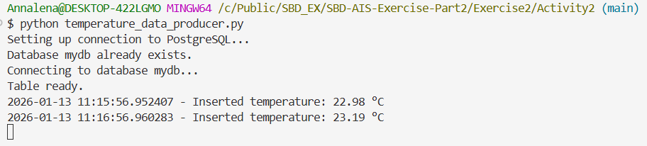

# Exercise 11: Concise Documentation
**Name:** Annalena Salchegger  
**Time:** 7 hours

# Activity 1
**Considering the above part ```Debezium CDC with PostgreSQL and Kafka```, explain with your own words what it does and why it is a relevant software architecture for Big Data in the AI era and for which use cases.**

### 1. What it does?
- Debezium **monitors** our **PostgreSQL database**
- it captures **row-level changes**, like INSERT, UPDATE or DELETE
- then it **publishes** these **changes to Kafka topics** in real time 
- consumers can read the messages immediately without having to directly query the database

Basically we can think of Debizium as our live news feed for our database -> every time a change happens, it instantly gets broadcasted to anyone subscribed to it

### Why is it relevant for Big Data and AI?
- **High velocity** -> AI systems often need the latest data (and as fast as possible)
- **Multiple consumers** -> Many analytics or AI pipelines need the same data
- **Decoupling** -> The systems stay independent and scalable
- **Data consistency** -> PostgreSQL guarantees strong consistency  

Debezium CDC streams any changes from the database into Kafka in real-time. This allows multiple systems to process consistent and up-to-date data at scale without slowing down the database. An architecture like this is especially relevant for Big Data and AI because you can:
- Analyze data instantly
- Train AI models on the latest information
- Monitor systems live, without hurting the database performance

### What are typical use cases?
| Use Case                       | Explanation                                                                     |
| ------------------------------ | ------------------------------------------------------------------------------- |
| **Real-time dashboards**       | Show live stats (e.g. number of active users) without querying DB continuously |
| **Fraud detection**            | Detect anomalies immediately when a transaction is inserted                     |
| **AI pipelines**               | Feed fresh data to models for online learning                                   |
| **Data replication**           | Mirror DB changes to data lakes or warehouses                                   |
| **Event-driven microservices** | Trigger workflows automatically when DB rows change                             |


# Activity 2
## Part 1
**In a simple use case where sensor readings need to be processed every 10 minutes to calculate the average temperature over that time window, describe which software architecture would be most appropriate for fetching the data from PostgreSQL, and explain the rationale behind your choice.**

### Answer to part 1
I would opt for a **batch/polling architecture**, because:
- the consumer queries the database **every 10 minutes**
- the data gets processed in **10-minute windows** 
- it is simple, resource efficient and easy to operate
- there is only one **single customer** -> thus no parallel processing is required
- the **volume is low** -> we don't need real-time streaming

To sum it up, a batch/polling architecture seems appropriate to me: the consumer polls the PostgreSQL every 10 minutes to calculate the averages of the measured temperatures.   
This approach is sufficeint for low-volume data, simple and resource-efficient.

## Part 2
**From the architectural choice made in ```Part 1```, implement the solution to consume and processing the data generated by the ```temperature_data_producer.py``` file (revise its features!). The basic logic from the file ```temperature_data_consumer.py``` should be extended with the conection to data source defined in ```Part 1```'s architecture.**

### Answer to part 2
```python
#import os
#import subprocess
#import sys
import time
from datetime import datetime, timedelta
import psycopg 
from psycopg import sql

# PostgreSQL connection info
DB_NAME = "mydb"
DB_USER = "postgres"
DB_PASSWORD = "postgrespw"
DB_HOST = "127.0.0.1"
DB_PORT = 5433
DB_TABLE = "temperature_readings"


# -------------------------
# Periodically compute average over last 10 minutes
# -------------------------
try:
    while True:
        ten_minutes_ago = datetime.now() - timedelta(minutes=10)
        ## Fetch the data from the choosen source (to be implemented)
        
        #Connect to PostgreSQL
        with psycopg.connect(
            dbname=DB_NAME,
            user=DB_USER,
            password=DB_PASSWORD,
            host=DB_HOST,
            port=DB_PORT
        ) as conn:
            #Using a context manager for the cursor
            with conn.cursor() as cursor:
                query = sql.SQL("SELECT * FROM {} ORDER BY id DESC LIMIT 10").format(sql.Identifier(DB_TABLE))
                cursor.execute(query)
                result = cursor.fetchall()
        
        if not result:
            print(f"{datetime.now()} - No data in last 10 minutes.")
        else:
            #Extract temperature values (assuming the temperature is in the 3rd column)
            temp_values = [record[2] for record in result]
            avg_temp = sum(temp_values) / len(temp_values)
            print(f"{datetime.now()} - Average temperature last 10 minutes: {avg_temp:.2f} °C")
        time.sleep(600) #every 10 minutes
except KeyboardInterrupt:
    print("Stopped consuming data.")
finally:
    print("Exiting.")
```
**Explanation:**  
The consumer connects directly to PostgreSQL using `psycopg` and retrieves the last 10 readings every 10 minutes to compute the average temperature from the 10-minute windows. It uses a curser context manager to ensure that the connections and cursors are automatically closed after the use.  

In summary, the script directly implements the batch/polling approach: 
- it periodically queries the database, 
- fetches recent sensor readings, 
- computes the average and 
- logs the result   

This setup is lightweight, easy to deploy, and fully sufficient for the low-volume sensor data.

## Part 3
**Discuss the proposed architecture in terms of resource efficiency, operability, and deployment complexity. This includes analyzing how well the system utilizes compute, memory, and storage resources; how easily it can be operated, monitored, and debugged in production.**

### Answer to part 3
**Resource Efficiency**  
The system is very resource efficient:
- **CPU** usage is minimal because we only perform a simple arithmetic
- **Memory** usage is also low becasue we only load the last 10 rows at a time
- **Storage growth** is slow, due to the low data volume (~ 1 per minute) -> we don't need a huge amount of database space

**Operability**  
The consumer is pretty easy to operate. It can be started and stopped manually and logs the outputs to the console for monitoring. I decided to use a context manager to ensure that the connections and cursors are safely managed, reducing the chance of any resource leaks.

**Deployment Complexity**  
The deployment is simple, we only need the PostgreSQL database and the Python script. There are no messaging brokers, connectors or orchestrators needed. The system can run on a single machine, which makes the setup and maintanace straightforward. We could even scale it slightly without having to change the architecture.

In conclusion, the batch/polling architecture is simple and well-suited for the low-volume, single consumer scenario.

  


# Activity 3

## Part 1

**Describe which software architecture would be most appropriate for fetching the data from PostgreSQL and generate alerts in real-time. Explain the rationale behind your choice.**

### Answer to part 1
In this scenario, I would opt for a streaming, event-driven architecture using Debezium CDC with PostgreSQL and Kafka.

PostgreSQL stays our system of record while Debezium captures any row-level changes and streams them to Kafka in real time. Kafka then distributes the data to multiple independent consumers, such as fraud detection agents, that can generate alerts with low latency.  

This architecture works well because:
- the **data volume** is **very high**
- near **real-time processing** is required
- there are **multiple consumers**
- direct database polling would not scale

Summed up, a CDC-based streaming architecture enables scalable, low-latency fraud detection while protecting the database from heavy read workloads.


## Part 2
**From the architectural choice made in ```Part 1```, implement the 'consumer' to fetch and process the records generated by the ```fraud_data_producer.py``` file (revise its features!). The basic logic from the files ```fraud_consumer_agent1.py.py``` and ```fraud_consumer_agent2.py.py``` should be extended with the conection to data source defined in ```Part 1```'s architecture.**

### Answer to part 2

```python
consumer = KafkaConsumer(
    "dbserver1.public.transactions", #Debezium topic
    bootstrap_servers="127.0.0.1:9094",
    auto_offset_reset="latest",
    enable_auto_commit=False,
    group_id="fraud-detection-group1", # and "fraud-detection-group2"
    value_deserializer=lambda m: json.loads(m.decode("utf-8"))
)
```

  
  
  

**Explanation:**  
The consumer connects to Kafka, subscribing to the Debezium topic `"dbserver1.public.transactions"` that streams changes from PostgreSQL in real time. Each message contains a transaction event, which is deserialized from JSON.

So in short:
- it consumes high-volume transaction data from Kafka,
- applies real-time fraud detection logic, and
- outputs alerts immediately

## Part 3
**Discuss the proposed architecture in terms of resource efficiency, operability, maintainability, deployment complexity, and overall performance and scalability. This includes discussing how well the system utilizes compute, memory, and storage resources; how easily it can be operated, monitored, and debugged in production; how maintainable and evolvable the individual components are over time; the effort required to deploy and manage the infrastructure; and the system’s ability to sustain increasing data volumes, higher ingestion rates, and a growing number of fraud detection agents without degradation of latency or reliability.**

### Answer to part 3
**Resource Efficiency**
- CPU usage is low because each consumer performs lightweight, per-event computations
- Memory usage is controlled through in-memory buffers (e.g., last 50 transactions or sliding windows per user)
- Storage is minimal on the consumer side

**Operability**
- The system is easy to start, stop, and monitor via the console logs
- Kafka decouples consumers from the database and ensures that the events are delivered reliably, which reduces the operational risks

**Maintainability**
- Consumers are modular and independent which means that the detection logic can be updated without affecting any other agents
- Adding new detection agents is straightforward -> you can simply subscribe to the Kafka topic

**Deployment Complexity**
- Only requires PostgreSQL, Kafka, and Debezium
- Deployment can be managed locally or with Docker
- Scaling can be achieved by adding more consumer instances

**Performance and Scalability**
- The architecture supports high ingestion rates (-> hundreds of thousands of records per second)
- Multiple consumers can process the data concurrently without impacting the database
- Latency remains low even as the data volume or number of agents increases

**Side Note:**  
During testing, all connections were successfully established, but the fraud detection logic did not flag any anomalies.

**Conclusion**  
The CDC + Kafka streaming architecture is pretty efficient, modular, scalable and enables real-time fraud detection while keeping the database protected. It supports multiple consumers, high data throughput, and low-latency processing, which  makes it suitable for high-volume transactional systems.


## Part 4
**Compare the proposed architecture to Exercise 3 from previous lecture where the data from PostgreSQL was loaded to Spark (as a consumer) using the JDBC connector. Discuss both approaches at least in terms of performance, resource efficiency, and deployment complexity.** 

### Answer to part 4
**Performance**
- **Debezium + Kafka** (my current architecture) processes transactions in **near real time** which enables immediate fraud detection
- **PostgreSQL -> Spark via JDBC** is **batch-oriented**, this means that Spark queries the database periodically, so alerts are delayed by the batch interval
- For **high-frequency/high-volume data**, I would say that Kafka scales better because it avoids overloading the database with repeated queries

**Resource Efficiency**
- Kafka consumers use **minimal CPU and memory**, the events are only processed once as they arrive
- Spark with JDBC requires **more memory and CPU** -> for processing entire data partitions must be loaded into Spark (even for small incremental changes)
- Kafka reduces the **database load**, whereas JDBC polling can stress the DB under high ingestion rates

**Deployment Complexity**
- **Debezium + Kafka** requires setting up PostgreSQL, Kafka brokers, and the Debezium connector, but also scales easily with multiple independent consumers
- **Spark + JDBC** requires a Spark cluster, JDBC configuration, and proper scheduling -> this can add overhead and maintenance complexity
- Kafka is more **modular**: what I mean by  that is -> adding or updating consumers is simpler than modifying Spark jobs

**Summary**  
JDBC + Spark is better suited for batch analytics or historical data, given its higher resource usage and more complex deployment.   
For our case, where we deal with fraud detection, the CDC + Kafka architecture definitely takes the lead, because it is in real-time, it is resource-efficient and scalable.

