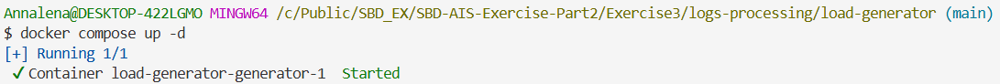
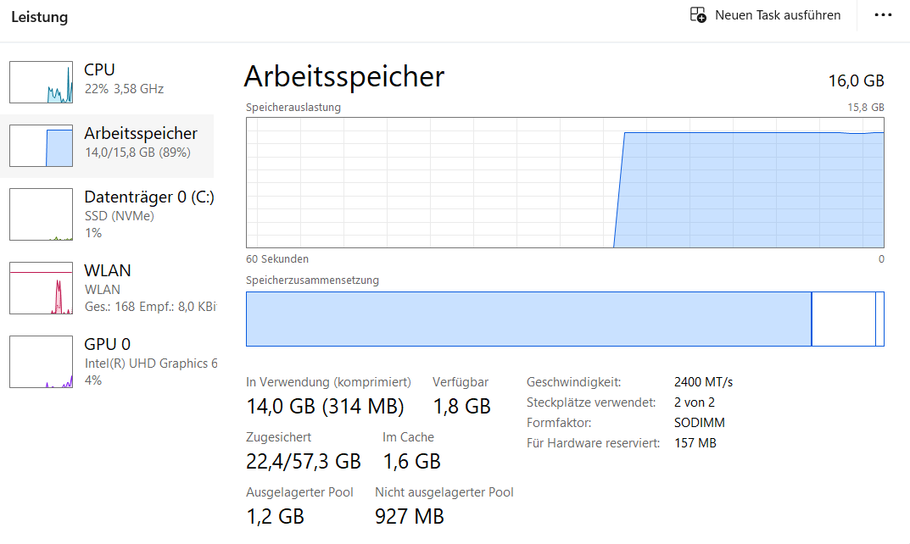
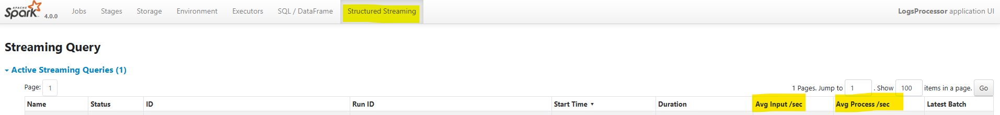

# Exercise 3: Activity 1 and 2
**Name:** Annalena Salchegger  
**Time:** 5.5 hours


## Activity 1: Understanding the execution of Spark applications

### Step 1: Acessing the Inteface
The Web UI is hosted by the Driver: http://localhost:4040 is up and running.


### Step 2: Key Concepts
#### A. The Jobs Tab & DAG Visualization
Every **Action** (like `.count()`, `.collect()`, or `.save()`) triggers a Spark Job. 
* **Task:** Click on a Job ID to see the **DAG Visualization**.
* **Concept:** Observe how Spark groups operations. Transformations like `map` or `filter` stay in one stage, while `sort` or `groupBy` create new stages.  

  

#### B. The Stages Tab
Stages represent a set of tasks that can be performed in parallel without moving data between nodes.
* **Concept:** Look for **Shuffle Read** and **Shuffle Write**. This represents data moving across the network—the most "expensive" part of distributed computing.

  

#### C. The Executors Tab
This shows the "Workers" doing the actual computation.
* **Concept:** Check for **Data Skew**. If one executor has 10GB of Shuffle Read while others have 10MB, your data is not partitioned evenly.
  

### Step 3: **Practical Exploration Questions**
1. **The Bottleneck: Which Stage has the longest "Duration"? What are the technical reasons for it?**
   - **Observation:** Looking at the Stage Tab, Stage 108 has a duration of 39 seconds, which is significantly higher than most of the other stages (most of them are between 4 and 20 seconds).
   - **Technical Reasons:** 
     - **Shuffle Overhead:** As can be seen in the screenshot below, stage 108 involves both **Shuffe Read (12.7 KiB)** and **Shuffle Write (7.8 KiB)**. Shuffling is the most "expensive" operation becasue the data must be serialized, sent over to the network and then deserialized.
     - **State Management:** The DAG shows `StateStoreRestore` and `StateStoreSave`. Spark has to "load" previous counts from memory, add the new data, and "save" the new total for every batch.
     - **Serialization:** Data must be converted into bytes (serialized) to be sent over the network or saved to the `StateStore`, this adds CPU overhead.


2. **Resource Usage: In the Executors tab, how much memory is currently being used versus the total capacity?**
   - **Observation:** **10.7 MiB** of the **848.3 MiB** available Storage Memory are used.
   - **Analysis:** The app is only using about 1.26% of its assigned memory.
   - **Meaning:** The system is currently over-provisioned (=> allocates more resources than needed). There is plenty of RAM left to handle much more data without crashing.

3. **Explain with your own words the main concepts related to performance and scalability in the scenario of Spark Structured Streaming.**  
   - **Performance** is limited by the `Shuffle` and `State Management` -> moving data between nodes and updating historical counts in the StateStore are the most "expensive" tasks.  
   - **Scalability** can be achieved with `parallelism` -> adding more Executors and increasing the Kafka partitions let's us process more data at once.
   - **Data Skew:** If for example one IP address sends way more logs than the others, one executor will do all the work while the others wait -> this creates a bottleneck.

### Step 4: Summary of "Activity 1"
Spark is processing the data streams sequentially or through task-switching on a single executor, because we created the Kafka topic with 2 partitions and the application was submitted with 1 executor. In oder to scale this, we would increase the `--num-executors` to match the partition count.

  

  

---

## Activity 2: Tuning for High Throughput

## Step 1: Increasing the Data Load (= Input)
In order to test the "High Trhroughout", the system needs to send more logs.  
1. I open the `docker-compose.yaml` in `Exercise3/logs-processing/load-generator`  and change the records-per-second to:
   - **TARGET_RPS=20000**
2. Then in I run `docker compose up -d` in the same folder  



### Step 2: The Tuning
Now I update the "baseline configuration" because the old one only uses 1 core and 1GB of RAM, which is too slow for a high volume.  
1. In the Terminal that is attached to the `spark-client`container, I stop the old Spark job with `Ctrl + C`.
2. Then I executed the following command, which adjusts the (cores, memory and partitions):  

```bash
spark-submit \
  --master spark://spark-master:7077 \
  --packages org.apache.spark:spark-sql-kafka-0-10_2.13:4.0.0 \
  --num-executors 2 \
  --executor-cores 2 \
  --executor-memory 2G \
  --conf "spark.sql.shuffle.partitions=4" \
  /opt/spark-apps/spark_structured_streaming_logs_processing.py
```

## Step 3: What did I change and why?
- `--num-executors 2`: moving from 1 to 2 workers to share the load  
- `--executor-cores 2`: each worker can now do 2 things at once instead of 1  
- `--executor-memory 2G`: double the RAM to handle the larger "micro-batches" of data  
- `spark.sql.shuffle.partitions=4`: reduce this from the default (200) to 4  

### Step 4: **ISSUES**
With this initial setting, and ALL others that I tried (e.g. lower load, 1 executor, 1G memory, or adding `--conf "spark.streaming.backpressure.enabled=true"`, etc.) my RAM was constantly at its absolute limit.  

The application always got stuck on `Batch 0` for 20+ minutes with 0/2 stages completed. I tried to fix this issue asking Gemini for help, but still I couln't find a way to get this to work. Unfortunately VSCode and Docker already take up all the resources I have.  
Nevertheless, I found out why it is not working:
- **Batch 0** is the hardest becasue the Driver has to talk to Kafka, set up the "StateStore" for the counts and start the Executors all at once.
- **Hardware Limits:** because my RAM was almost full, my computer started "paging" (swapping RAM to the slow SSD), which makes simple tasks take forever.
- **Lesson I learned:** Scaling is more about balancing the resources and not just about high numbers in a command. If I had a cloud cluster like AWS where each Spark worker could have their own decdicated RAM - so they don't have to fight with VSCode or Docker for space 🥲 - I would move it there.




### Step 5: **How I would have continued IF it worked**
1. Verify that everything works by opening http://localhost:4040  
2. Click on the **Structured Streaming** tab  
3. Check out the **Input Rate vs the Process Rate**:  
   - If the process rate is equal or higher than the input rate, the tuning worked.  
   - If the input rate is higher then I would need more cores because it means that the data is piling up.  

4. **Monitor Latency:** The goal was to keep the Batch Duration under 20 seconds. If it stayed high, it would prove that the 2 cores were still a bottleneck.
5. **Check for Data Skew:** I would look at the `SQL/Queries Tab` and the `DAG` for any "Exchange" blocks that were taking too long. If one task was doing way more work than others, it would mean the data wasn't distributed evenly across my cores.  
6. **Resource Check:** I would use the `Executors Tab` to see if the cores were actually at 100% usage or if they were just "waiting" (`Thread Dump`).
