# Exercise 3: Activity 1, 2 and 3
**Name:** Annalena Salchegger  
**Time:** +10 hours


## Activity 1: Understanding the execution of Spark applications

### Step 1: Acessing the Inteface
The Web UI is hosted by the Driver: http://localhost:4040 is up and running.  
It is hosted by the **Spark Driver**, which is responsible for job scheduling and coordination.

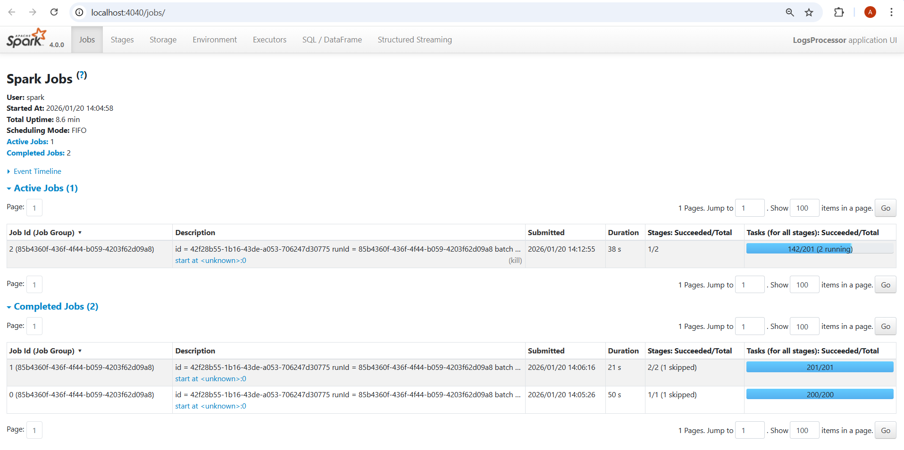

### Step 2: Key Concepts
#### A. The Jobs Tab & DAG Visualization
Every **Action** (like `.count()`, `.collect()`, or `.save()`) triggers a Spark Job. 
* **Task:** Click on a Job ID to see the **DAG Visualization**.
* **Concept:** Observe how Spark groups operations. Transformations like `map` or `filter` stay in one stage, while `sort` or `groupBy` create new stages.  

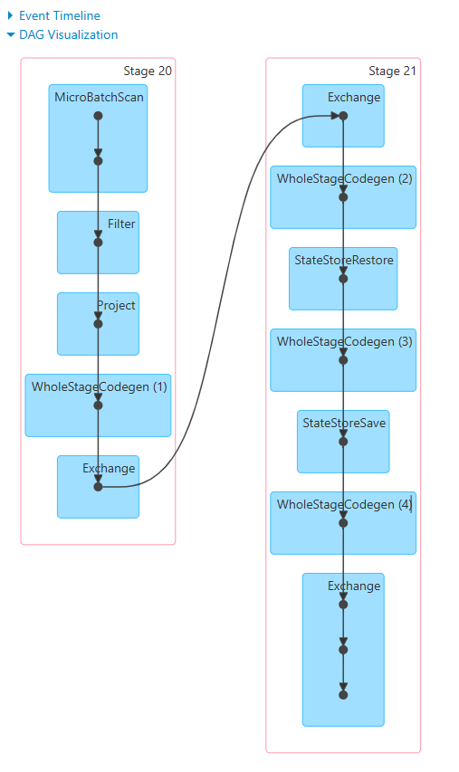  

#### B. The Stages Tab
Stages represent a set of tasks that can be performed in parallel without moving data between nodes.
* **Concept:** Look for **Shuffle Read** and **Shuffle Write**. This represents data moving across the network—the most "expensive" part of distributed computing.

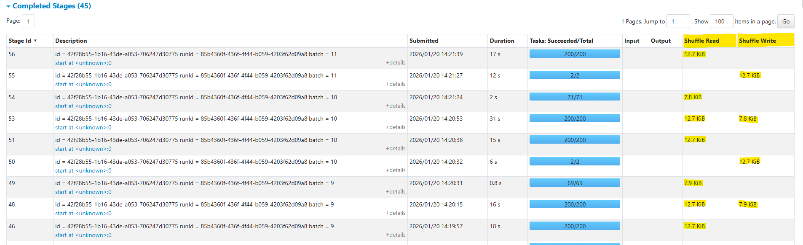  

#### C. The Executors Tab
This shows the "Workers" doing the actual computation.
* **Concept:** Check for **Data Skew**. If one executor has 10GB of Shuffle Read while others have 10MB, your data is not partitioned evenly.
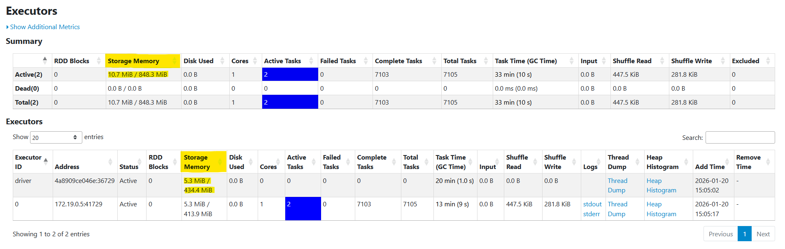  

### Step 3: **Practical Exploration Questions**
1. **The Bottleneck: Which Stage has the longest "Duration"? What are the technical reasons for it?**
   - **Observation:** Looking at the Stage Tab, Stage 108 has a duration of 39 seconds, which is significantly higher than most of the other stages (most of them are between 4 and 20 seconds).
   - **Technical Reasons:** 
     - **Shuffle Overhead:** As can be seen in the screenshot below, stage 108 involves both **Shuffe Read (12.7 KiB)** and **Shuffle Write (7.8 KiB)**. Shuffling is the most "expensive" operation becasue the data must be serialized, sent over to the network and then deserialized.
     - **State Management:** The DAG shows `StateStoreRestore` and `StateStoreSave`. Spark has to "load" previous counts from memory, add the new data, and "save" the new total for every batch.
     - **Serialization:** Data must be converted into bytes (serialized) to be sent over the network or saved to the `StateStore`, this adds CPU overhead.


2. **Resource Usage: In the Executors tab, how much memory is currently being used versus the total capacity?**
   - **Observation:** **10.7 MiB** of the **848.3 MiB** available Storage Memory are used.
   - **Analysis:** The app is only using about 1.26% of its assigned memory.
   - **Meaning:** The system is currently over-provisioned (=> allocates more resources than needed). There is plenty of RAM left to handle much more data without crashing.

3. **Explain with your own words the main concepts related to performance and scalability in the scenario of Spark Structured Streaming.**  
   - **Performance** is limited by the `Shuffle` and `State Management` -> moving data between nodes and updating historical counts in the StateStore are the most "expensive" tasks.  
   - **Scalability** can be achieved with `parallelism` -> adding more Executors and increasing the Kafka partitions let's us process more data at once.
   - **Data Skew:** If for example one IP address sends way more logs than the others, one executor will do all the work while the others wait -> this creates a bottleneck.

### Step 4: Summary of "Activity 1"
Spark is processing the data stream with limited parallelism, because the Kafka topic has only 2 partitions and the application was submitted with a single executor and a single core. This limits the number of tasks that can run concurrently. In oder to scale this, we would increase the `--num-executors` to match the partition count and potentially increase the number of Kafka partitions to further increase parallelism.

  

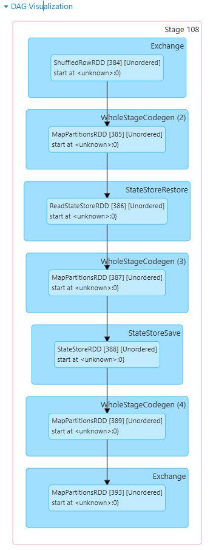  

---

## Activity 2: Tuning for High Throughput

**The goal** of this activity was to tune a Spark Structured Streaming application to process a high volume of log events while maintaining low micro-batch latency. Performance was evaluated using the Spark Web UI, with a focus on throughput, batch duration, and resource utilization.

### Step 1: Necessary fixes
My initial tuning attempt failed due to Kafka topic state and streaming initialization issues, which caused the application to stall during the first micro-batch.
After resetting the Kafka topic and aligning Spark parallelism with the Kafka partitions, the application ran successfully and could be analyzed using the Structured Streaming UI.

#### Specific fixing steps:
1. **delete the kafka topic** 
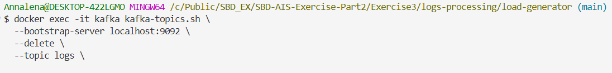
2. **add a new configuration for the kafka topic** 
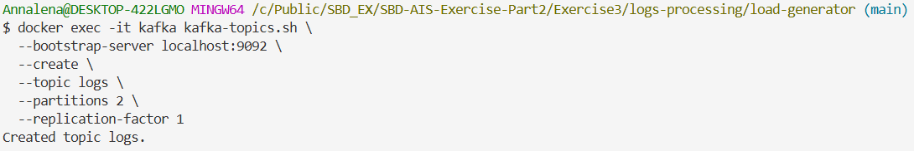
3. **changed the spark command to this:**
   ```bash
   #Submit Spark structured streaming job for logs processing
   spark-submit \
     --master spark://spark-master:7077 \          #Spark master URL
     --packages org.apache.spark:spark-sql-kafka-0-10_2.13:4.0.0 \  #Kafka integration
     --num-executors 1 \                           #Single executor
     --executor-cores 1 \                          #One core per executor
     --executor-memory 1G \                        #1GB memory per executor
     --conf "spark.sql.shuffle.partitions=2" \     #Shuffle partitions configuration
     /opt/spark-apps/spark_structured_streaming_logs_processing.py  #Application path
   ```  

4. **then I start the load generator again**
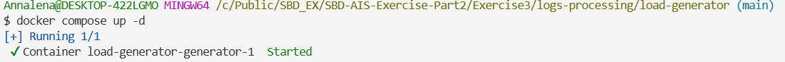
5. **Now we go to the spark interface and look at the results**
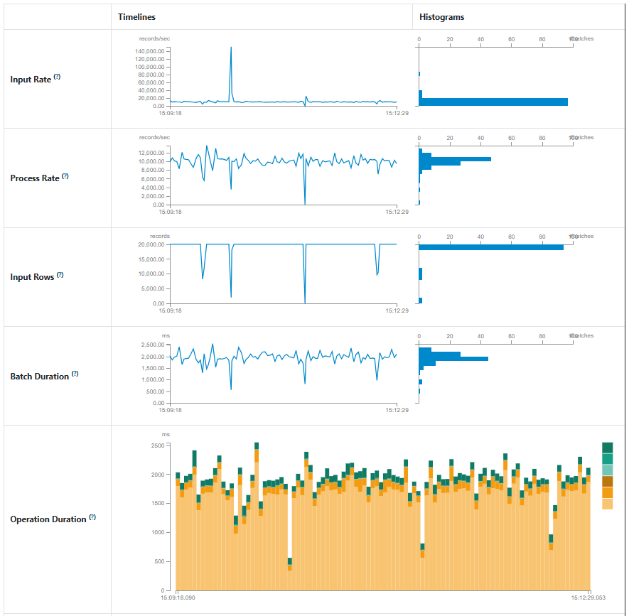


### Step 2: Monitoring Throughput Using the Structured Streaming UI

**Input Rate vs Process Rate**  
The input rate fluctuated around 10000-15000 records per second, while the **processing rate** closely **matched the input rate**. This indicates that the application was able to keep up with the incoming data stream without accumulating backlog.  

**Batch Duration**  
The micro-batch durations remained **stable** between approximately 1.5 and 2.5 seconds, which is well **below** the **target threshold** of 20 seconds. This demonstrates low latency and sufficient computational resources for the current workload.  


### Step 3: Excutor Resource Utilization  
The **Executors tab** shows a **single active executor** with **one core** and approximately 400 MiB of memory in use. No failed tasks occurred, and task execution was evenly distributed.

This indicates that:  
- the executor is efficiently utilized,
- no memory pressure or excessive garbage collection occurs and
- the system is well balanced for the chosen configuration.

### Step 4: DAG Analysis, Shuffles and Data Skew
The **DAG visualization** reveals two main stages separated by shuffle operations. The first stage reads the data from Kafka and applies filtering and projection. The second stage performs stateful aggregation using `StateStoreRestore` and `StateStoreSave`.

Shuffle read and write volumes are small and evenly distributed -> no executor shows disproportionately high shuffle activity. This indicates that no significant data skew is present and that workload distribution across tasks is balanced.

### Step 5: Evaluation of Tuning Parameters
- **Number of Executors:** Increasing executors would allow more parallelism, but only if Kafka partitions are increased accordingly as well.
- **Executor Cores:** Additional cores increase task parallelism within an executor but must match the available CPU threads.
- **Executor Memory:** Higher memory allows larger state and shuffle data to be kept in RAM, reducing disk I/O.
- **Shuffle Partitions:** Matching the shuffle partitions to the Kafka partitions avoids unnecessary overhead and improves scheduling efficiency.

For me - given this setup - a small, well-aligned configuration performed better than an over-provisioned one.

### Conclusion of "Activity 2"
By aligning Spark parallelism with Kafka partitioning and validating performance using the Spark Web UI, the application achieved stable high-throughput processing with low latency. This shows that effective tuning is not about maximizing resource values, but about balancing parallelism, memory, and input characteristics to match the underlying data source and hardware constraints.

---

## Activity 3: Monitoring User Experience in near real-time

### Step 1: Setting up the Spark Structured Streaming Application
The goal is to continuously monitor the logs to identify critical crash events per user and count them every 10 seconds based on the event timestamps.

**Spark Command:**
```bash
#Submit Spark structured streaming job for logs processing
spark-submit \
   --master spark://spark-master:7077 \          #Spark master URL
   --packages org.apache.spark:spark-sql-kafka-0-10_2.13:4.0.0 \  #Kafka integration
   --num-executors 1 \                           #Single executor
   --executor-cores 1 \                          #One core per executor
   --executor-memory 1G \                        #1GB memory per executor
   --conf "spark.sql.shuffle.partitions=2" \     #Shuffle partitions configuration
   /opt/spark-apps/spark_structured_streaming_crash_monitoring.py  #Application path
   ```

### Step 2: Creating the source code for Crash Event Monitoring
see ```spark_structured_streaming_crash_monitoring.py```

### Step 3: Execution and Monitoring
After deploying the script, I monitored the application via the Structured Streaming and Executors tabs.

- **Input vs Process Rate:** The application maintained an average input rate of 10000 to 15000 records/sec. The process rate mirrored this -> indicating no processing lag.
- **Batch Duration:** Micro-batches consistently completed in 2.0 to 3.0 seconds, which is within the 10-second window requirements.
- **State Management:** As shown in the "Aggregated Number of Total State Rows" graph, the state fluctuates between 400 and 600 rows. This indicates that Spark is successfully "cleaning up" old window data from memory as time progresses, preventing unbounded memory growth.

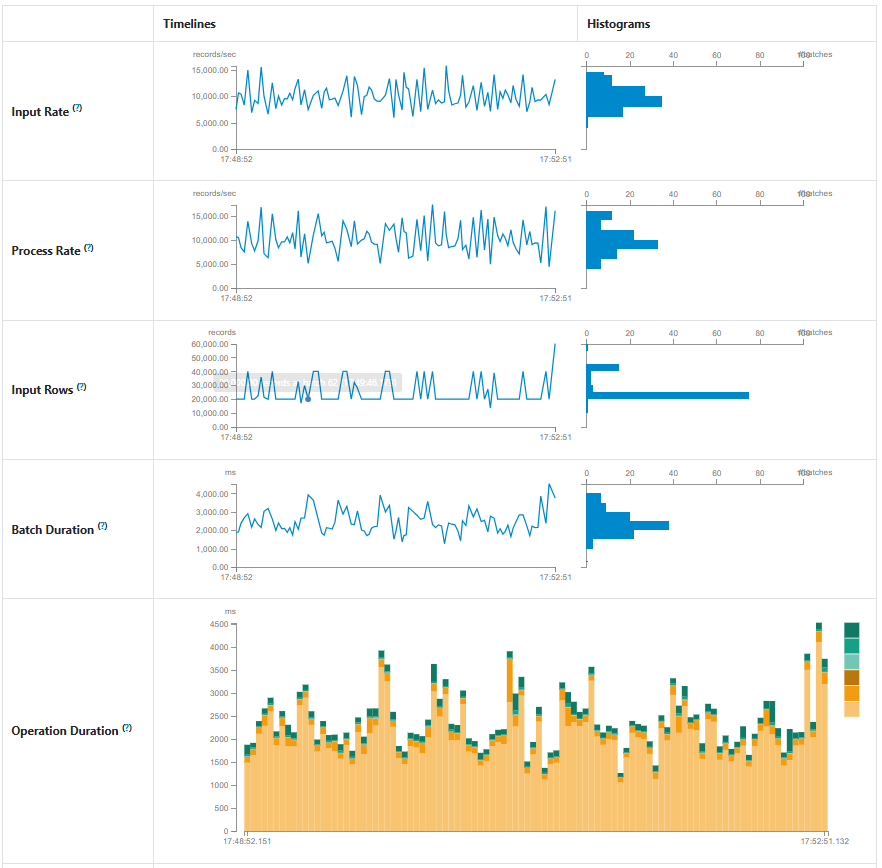
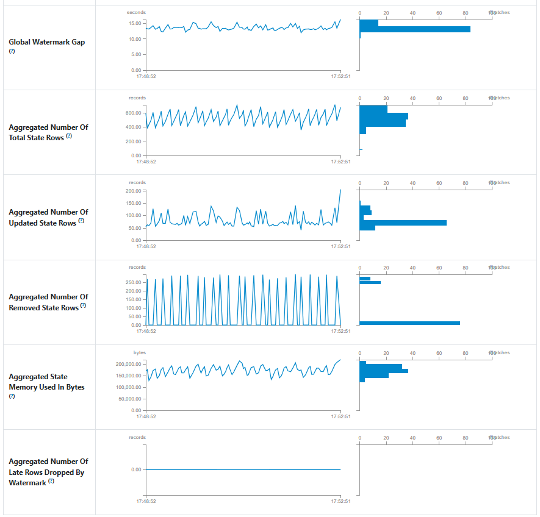
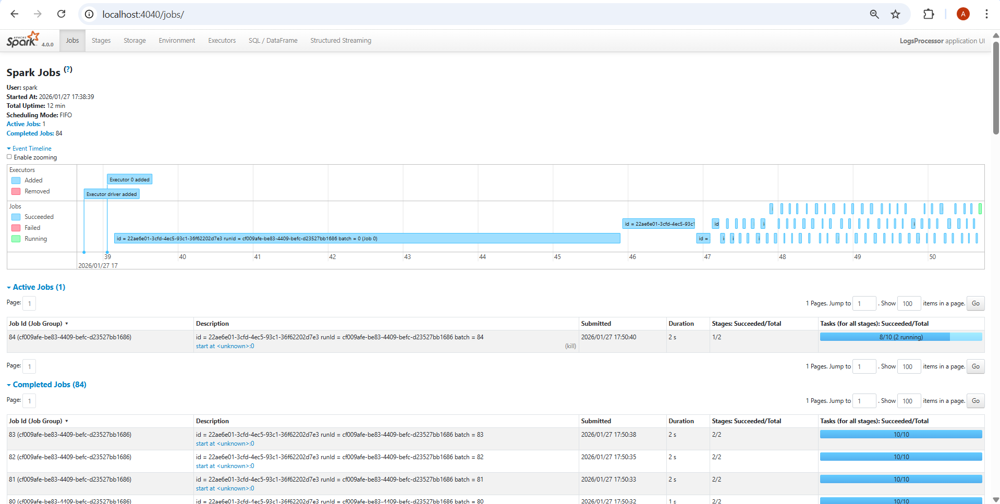
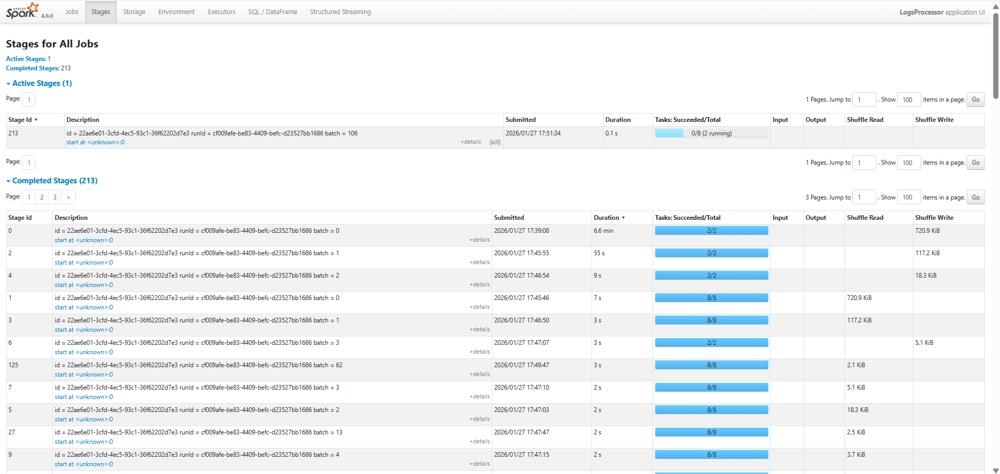
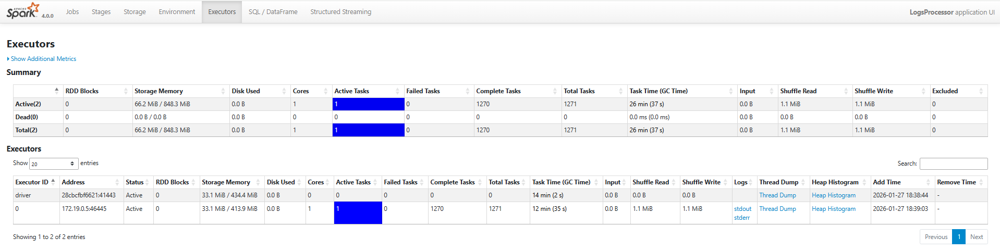

### Step 4: Technical Discussion 
**Handling Late-Arriving Records**  
In a real-world scenario, logs might arrive delayed due to network latency. To handle this, my implementation utilizes Watermarking.
- **Logic:** By defining a watermark (e.g. `.withWatermark("event_time", "10 seconds")`), Spark will maintain the state for a specific window for an additional 10 seconds after the window has "technically" closed.
- **Observation:** In the "Global Watermark Gap" graph, we see a steady gap of approximately 12 seconds. This ensures that if a "crash" event occurs at 18:29:55 but only reaches Spark at 18:30:07, it is still correctly aggregated into the 18:29:50-18:30:00 window rather than being dropped.

**Scalability and Fault Tolerance**  
- **Fault Tolerance:** The system uses Checkpointing. By saving the state and the current offset to a reliable storage, if the worker node fails, a new executor can pick up exactly where the last one left off without losing the current "crash counts."
- **Scalability:** The DAG Visualization shows the job split into two stages: 
   - `Stage 378` (Scan/Filter/Project) and 
   - `Stage 379` (Exchange/StateStore).  
  Because the data is partitioned by `user_id` during the Exchange (Shuffle) phase, we can easily scale horizontally. Adding more executors would allow Spark to distribute different `user_id` groups across the cluster, handling millions of users simultaneously.
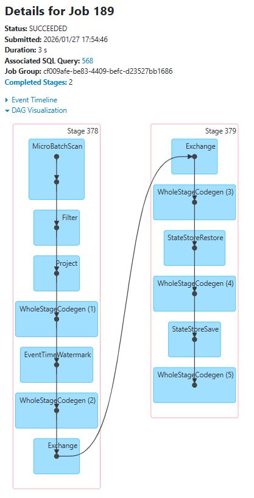

### Step 5: Performance and Scalability (for a better/concise overview)
| Metric | Observation | Analysis |
|--------|-------------|----------|
| **Throughput** | ~12k records/sec | High efficiency for a single-core setup. |
| **Latency** | ~2.5s Batch Duration | Real-time requirement met; output is generated significantly faster than the 10s interval. |
| **Resource Usage** | 33.1 MiB Storage Memory | Only ~4% of allocated memory used for state. The solution is highly memory-efficient. |
| **Shuffle Efficiency** | 1.1 MiB Shuffle Write | Minimal data movement across the network despite grouping by user_id. |  


**Multi-Machine Execution:** In a multi-machine environment, the bottleneck would probably be the Shuffle (Exchange) phase. Currently, with `spark.sql.shuffle.partitions=2`, the work is only split into two tasks. For a larger cluster, I would increase this value 2-3x the number of available CPU cores to ensure that all machines are fully utilized and also to **avoid Data Skew**.


### Step 6: Example Output
   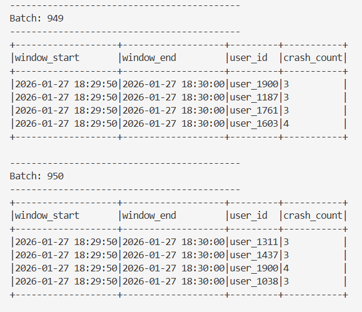

### Conclusion of "Activity 3"
The implementation successfully monitors the user experience in near real-time. By leveraging Event-Time Processing and Watermarking, the system remains accurate even with disordered data. The architecture is "production-ready" in terms of fault tolerance (via checkpoints) and scalability (via hash-partitioning on `user_id`).
